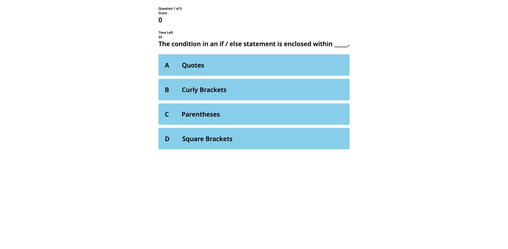

# Multiple Choice Quiz

This project is a web-based multiple choice quiz that features a timer and the ability to submit high scores. The user is presented with a series of multiple choice questions, and a timer counts down from a set time limit. If the user answers incorrectly, time is deducted from the timer. Once all questions have been answered, the user can submit their score to a high score board.

# Getting Started

To use this project, you can simply clone or download the code repository and open the index.html file in a web browser.

# Technologies Used

This project was built using HTML, CSS, and JavaScript. The project also uses local storage to store high scores, allowing the user to view their scores even after closing and reopening the web page.

# Demo

# Link

https://kyungkwon01.github.io/web-apis-code-quiz/
